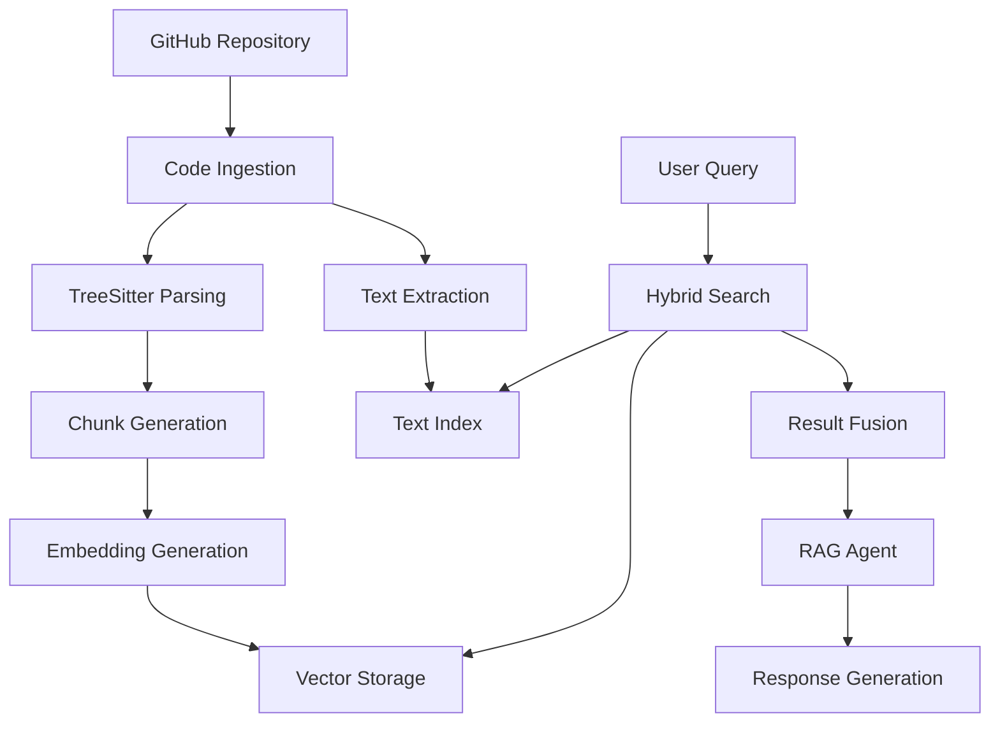

# Code-RAG: Semantic Code Search and Analysis Platform

## Project Overview

Code-RAG is an intelligent code analysis and search platform that combines traditional text search with modern semantic search capabilities. The system ingests codebases, processes them using advanced parsing techniques, and stores them in vector databases to enable sophisticated code discovery and understanding through a RAG (Retrieval-Augmented Generation) approach.

## Goals

The primary goal is to develop a comprehensive solution that makes large codebases more navigable and understandable by combining:

- **Intelligent Code Parsing**: Using TreeSitter for precise syntax-aware code chunking
- **Hybrid Search**: Combining semantic vector search with traditional text search
- **Contextual Understanding**: RAG-powered agents that can reason about code relationships
- **Interactive Interface**: User-friendly tools for exploring and understanding code

## Architecture Overview

### Core Components

1. **ETL Pipeline**
   - GitHub repository ingestion
   - TreeSitter-based code parsing and chunking
   - Metadata extraction from comments and documentation
   - Vector embedding generation

2. **Storage Layer**
   - Vector database for semantic search
   - Text index for traditional search
   - Metadata storage for code relationships

3. **Search Engine**
   - Hybrid search combining semantic and text-based results
   - Result ranking and fusion algorithms
   - Context-aware query processing

4. **RAG Agent**
   - Intelligent code analysis and explanation
   - Multi-modal reasoning over code and documentation
   - Interactive query processing

5. **User Interface**
   - Chunk insights and visualization
   - Search interface with filtering
   - Code exploration tools

## Technology Stack Analysis

### Core Framework Recommendations

#### AI/ML Stack
- **Pydantic AI**: For type-safe AI application development and structured outputs
- **LangChain**: For building RAG pipelines and agent workflows  
- **LangGraph**: For complex multi-agent workflows and state management
- **Tree-sitter**: For accurate, language-aware code parsing

#### Vector Database Options

| Database | Pros | Cons | Best For |
|----------|------|------|----------|
| **PostgreSQL + pgvector** | Mature, ACID compliance, SQL familiarity, cost-effective | Performance limitations at scale, limited vector operations | Small to medium projects, budget-conscious deployments |
| **Qdrant** | High performance, advanced filtering, open source, good Python SDK | Newer ecosystem, smaller community | High-performance requirements, complex filtering needs |
| **ChromaDB** | Simple setup, great for prototyping, good documentation | Limited scalability, fewer enterprise features | Development/prototyping, simple use cases |

**Recommendation**: Start with **PostgreSQL + pgvector** for initial development due to its stability and cost-effectiveness, with a migration path to **Qdrant** for production scale.

#### Additional Technologies
- **FastAPI**: High-performance API framework with automatic OpenAPI docs
- **React/TypeScript**: Modern frontend with strong typing
- **Docker**: Containerization for consistent deployment
- **Redis**: Caching layer for frequently accessed data

### Processing Pipeline



## First Release Features

### 1. ETL Pipeline for GitHub Codebases
- **Repository Ingestion**: Clone and process GitHub repositories
- **TreeSitter Integration**: Parse code with syntax awareness for multiple languages
- **Smart Chunking**: Create meaningful code segments (functions, classes, modules)
- **Metadata Extraction**: Extract information from:
  - Code comments and docstrings
  - README files and documentation
  - File structure and dependencies

### 2. Hybrid Search Infrastructure
- **Semantic Search**: Vector-based similarity search for conceptual matches
- **Text Search**: Traditional keyword-based search for exact matches  
- **Result Fusion**: Intelligent combination of both search methods
- **Language-Aware Processing**: Different strategies for different programming languages

### 3. Basic UI for Chunk Insights
- **Code Visualization**: Interactive display of code chunks with syntax highlighting
- **Relationship Mapping**: Visual representation of code dependencies and relationships
- **Metadata Display**: Show extracted information and context
- **Search History**: Track and revisit previous searches

### 4. RAG Agent with Dual Search
- **Query Processing**: Natural language understanding for code-related questions
- **Context Retrieval**: Intelligent selection of relevant code chunks
- **Response Generation**: Clear explanations with code examples and references
- **Multi-turn Conversations**: Maintain context across interactions

### 5. Search User Interface
- **Advanced Filters**: Filter by language, file type, repository, date ranges
- **Search Suggestions**: Auto-complete and query suggestions
- **Result Ranking**: Relevance-based ordering with user feedback
- **Export Capabilities**: Save searches and results for later reference

## Implementation Roadmap

### Phase 1: Foundation (Weeks 1-4)
- Set up development environment with Docker
- Implement basic GitHub repository ingestion
- Integrate TreeSitter for initial language support (Python, JavaScript, TypeScript)
- Create PostgreSQL database schema with pgvector

### Phase 2: Core Pipeline (Weeks 5-8)
- Develop chunking algorithms for different code structures
- Implement embedding generation pipeline
- Build hybrid search engine
- Create basic REST API with FastAPI

### Phase 3: RAG Integration (Weeks 9-12)
- Integrate Pydantic AI for structured outputs
- Implement LangChain-based RAG pipeline
- Develop query processing and response generation
- Add support for additional programming languages

### Phase 4: User Interface (Weeks 13-16)
- Build React-based frontend
- Implement search interface with advanced filtering
- Create chunk visualization components
- Add user authentication and project management

### Phase 5: Enhancement (Weeks 17-20)
- Performance optimization and caching
- Advanced analytics and insights
- Export and integration capabilities
- Documentation and testing

## Development Setup

### Prerequisites
- Python 3.9+
- Node.js 18+
- Docker and Docker Compose
- Git

### Quick Start
```bash
# Clone the repository
git clone https://github.com/edorosh/code-rag.git
cd code-rag

# Start development environment
docker-compose up -d

# Install Python dependencies
pip install -r requirements.txt

# Install frontend dependencies
cd frontend && npm install

# Run the application
npm run dev
```

## Contributing

We welcome contributions! Please see our [Contributing Guide](CONTRIBUTING.md) for details on how to get started.

## License

This project is licensed under the MIT License - see the [LICENSE](LICENSE) file for details.

## Roadmap and Future Features

- **Multi-language Support**: Expand beyond initial language set
- **Real-time Indexing**: Live updates as codebases change
- **Team Collaboration**: Shared workspaces and annotations
- **API Integration**: Connect with existing development tools
- **Advanced Analytics**: Code quality metrics and trend analysis
- **Cloud Deployment**: Scalable cloud-native architecture

---

*This project aims to revolutionize how developers explore, understand, and work with large codebases by combining the power of modern AI with traditional software engineering practices.*